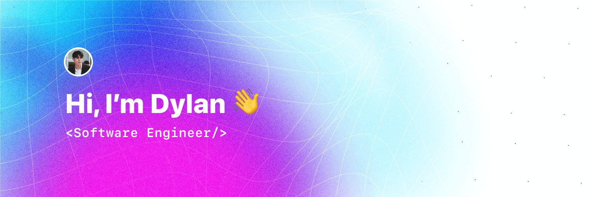

# Hi, I'm Dylan! 👋

[Portfolio](https://dylanwe.com), [LinkedIn](https://www.linkedin.com/in/dylan-weijgertze/)

### I’m a Software Engineer student at the [Amsterdam University of Applied Sciences](https://www.hva.nl/) and I enjoy programming and reading.

- 🧑🏻‍💻 I `code` in **Kotlin, TypeScript, Go, SQL, CSS and HTML**
- 🎨 The `tools` I use are **Git, Docker and Kubernetes**
- 🌱 I’m currently `learning` **Azure and CI/CD**
